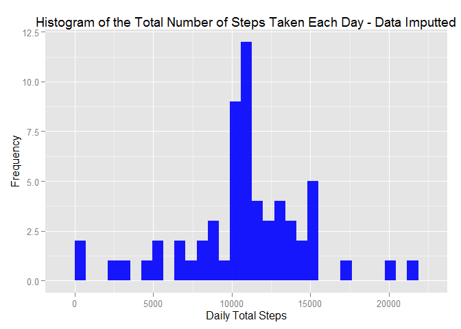

# Reproducible Research: Peer Assessment 1


## 1) Loading and preprocessing the data

The first step of this assignment is to load the data file "activity.csv".

```r
### Download data if data doesn't exists:
  DataFileName <- "repdata-data-activity.zip"
  
  if (!file.exists(DataFileName)){
    fileURL <- "https://d396qusza40orc.cloudfront.net/repdata%2Fdata%2Factivity.zip"
    download.file(fileURL, DataFileName)
  }  

### Unzip data if data file doesn't exists:
  if (!file.exists("activity.csv")) { 
    unzip(DataFileName) 
  }

### Load data from source file
  raw.data <- read.csv("activity.csv", head=TRUE)
```

After loading data from source file, we will remove N/A values and transfer the "date" field format to a date format. 

```r
### Remove NA values from "steps" filed
  activity.data <- subset(raw.data, !is.na(raw.data$steps))
  
### Convert "date"" field from factor to a date format
  activity.data$date <- as.Date(activity.data$date)
```

------


## 2) What is mean total number of steps taken per day?

To answer this question, we will process the original data to obtain the total step counts of each day.

```r
  ### Check if required package is loaded. If required packaged is not loaded, load it.
  if (!require("ggplot2")) install.packages("ggplot2")
```

```
## Loading required package: ggplot2
```

```r
  if (!require("reshape2")) install.packages("reshape2")
```

```
## Loading required package: reshape2
```

```r
  ### calculate the total number of steps per day
  total.steps.per.day <- melt(activity.data, id.vars="date", measure.vars="steps")
  total.steps.per.day <- dcast(total.steps.per.day, date ~ variable, sum)
```

Next, we generate a histogram of the total step counts of each day to show the distrubution of total steps.

```r
  ### plot histogram
  g2 <- ggplot(total.steps.per.day, aes(total.steps.per.day$steps)) 
  g2 <- g2 +  geom_histogram(fill = "green", alpha = 0.9) +
    labs(title="Histogram of the Total Number of Steps Taken Each Day") +
    labs(x="Daily Total Steps", y="Frequency") 
  g2
```

```
## stat_bin: binwidth defaulted to range/30. Use 'binwidth = x' to adjust this.
```


Next, we calculate the mean and median of the total steps numbers takden each day.

```r
  mean(total.steps.per.day$steps)
```

```
## [1] 10766.19
```

```r
  median(total.steps.per.day$steps)
```

```
## [1] 10765
```
------

## 3) What is the average daily activity pattern?
To answer this question, we process the original data and form a new data frame with the average steps at a 5 minute interval.

```r
  ave.steps.int_5 <- tapply(activity.data$steps, activity.data$interval, mean, na.rm=TRUE, simplify=T)
  data.frame.int_5 <- data.frame(interval=as.integer(names(ave.steps.int_5)), avg_steps=ave.steps.int_5)
```

Next, we will plot the average steps across the whole day at a 5-minute interval to see the daily acitivity pattern.

```r
  g3 <- ggplot(data.frame.int_5, aes(interval, avg_steps)) 
  g3 <- g3 +  geom_line() +
    labs(title="Daily Average Steps At A 5-Minute Interval") +
    labs(x="Intervals (minute)", y="Average Steps") 
  g3
```


------


## 4) Imputing missing values
To impute missing values, we need to calculate the amount of missing value of original data.

```r
  sum(is.na(raw.data$steps))
```

```
## [1] 2304
```
So there were 2304 rows of missing data from the original data. 

Then we are going to impute those missing data with the average steps of the same period of time from the data frame we generated at Section #3. 

```r
  index_list <- is.na(raw.data$steps)
  imputed.data <- raw.data
  imputed.data$steps[index_list] <- data.frame.int_5$avg_steps[as.character(imputed.data$interval[index_list])]
```

Next, we created a new dataset with imputed data.

```r
  new.total.daily.step <- melt(imputed.data, id.vars="date", measure.vars="steps")
  new.total.daily.step <- dcast(new.total.daily.step, date ~ variable, sum)
```

Next, we will plot a new histogram with imputed data to show the distribution of new dataset. 

```r
  g4 <- ggplot(new.total.daily.step, aes(new.total.daily.step$steps)) 
  g4 <- g4 +  geom_histogram(fill = "blue", alpha = 0.9) +
    labs(title="Histogram of the Total Number of Steps Taken Each Day - Data Imputted") +
    labs(x="Daily Total Steps", y="Frequency") 
  g4
```

```
## stat_bin: binwidth defaulted to range/30. Use 'binwidth = x' to adjust this.
```



Next, we calculate the mean and median of the total steps numbers takden each day from the new dataset.

```r
  mean(new.total.daily.step$steps)
```

```
## [1] 10766.19
```

```r
  median(new.total.daily.step$steps)
```

```
## [1] 10766.19
```

Comparing the distrubution, mean and median between original dataset and imputted dataset, there was no obvious change
after imputing data. It was becasue we imputted the missing with the average step value of the same period of time from the original dataset.

------


## 5) Are there differences in activity patterns between weekdays and weekends?
To answer this question, we create a function to check whether the given date is a weekday or weekend day. Then we call sapply function to create a new column "Weekday" to the imputted dataset to indicate the weekday status of each given date.

```r
  fun_check_weekday <- function(date) {
      weekday <- weekdays(date)
      if (weekday %in% c("Saturday", "Sunday"))
          return("weekend")
      else 
          return("weekday")
  }
  
  imputed.data2 <- imputed.data
  imputed.data2$date <- as.Date(imputed.data2$date)
  imputed.data2$weekday <- sapply(imputed.data2$date, FUN=fun_check_weekday)
```

Next, we create a new dataset to contain the average steps with date and weekday fields.

```r
  new.total.daily.step2 <- melt(imputed.data2, id.vars=c("interval","weekday"), measure.vars="steps")
  new.total.daily.step2 <- dcast(new.total.daily.step2, weekday + interval ~ variable, mean)
```

Then, we will make a plot with 2 panels to show the difference of daily average activities between weekdays and weekends.

```r
  g5 <- ggplot(new.total.daily.step2, aes(interval, steps)) + geom_line() + 
    facet_grid(weekday ~ .) +
    labs(title="Daily Average Steps Comparision: Weekday vs Weekend") +
    labs(x="Intervals (minute)", y="Average Steps") 
  g5
```


## Findings
- According to the data, we can tell the activities raises earlier in weekdays than weekends. 
- In general, weekends have higher activiti level compared with weekdays.
